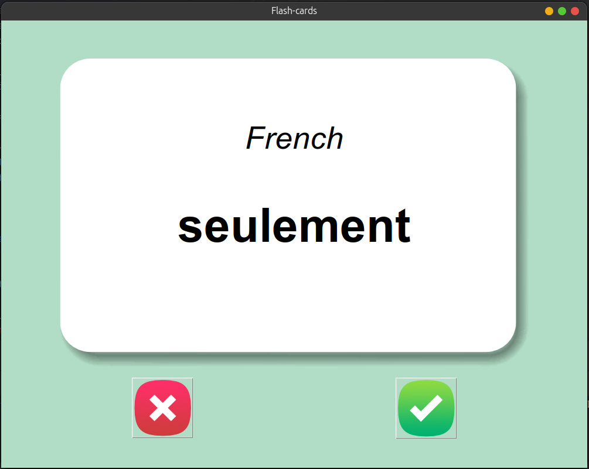
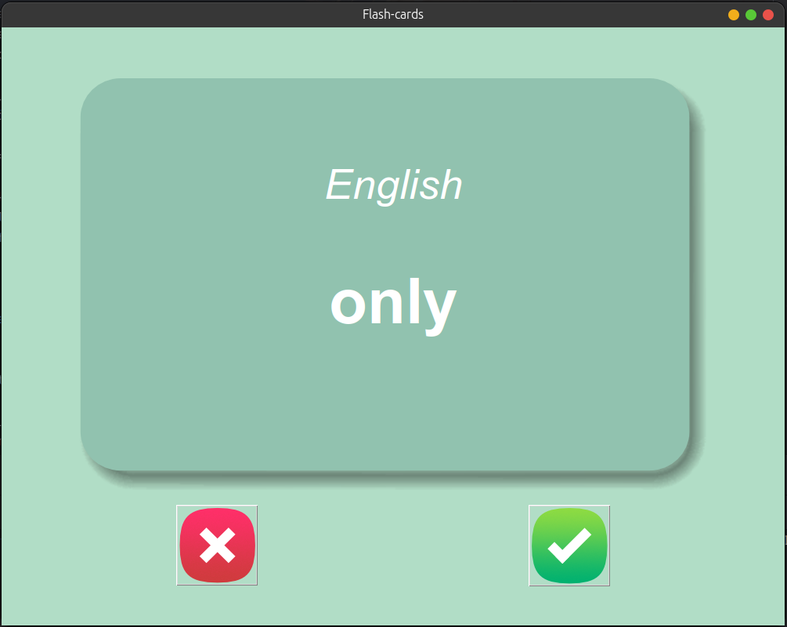

# French-English Flashcard  🇫🇷➡️🇬🇧
This Python project is a flashcard application designed to help users learn and memorize nearly 100 French words along with their English meanings. The project utilizes pandas for data handling and analysis, ensuring efficient management of the word list and user progress.

## Key Features:
- Flashcards: Interactive flashcards displaying French words and their corresponding English meanings.
- Word List Management: The word list is managed using pandas, allowing for easy updates and analysis of the data.
Progress Tracking: Users can track their progress as they learn new words.

### Technology Stack:
 ✅  Python | Pandas | Tkinter | Requests

